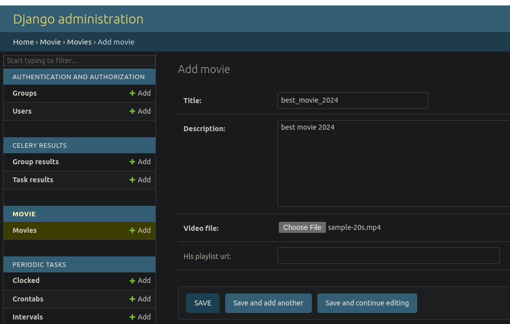
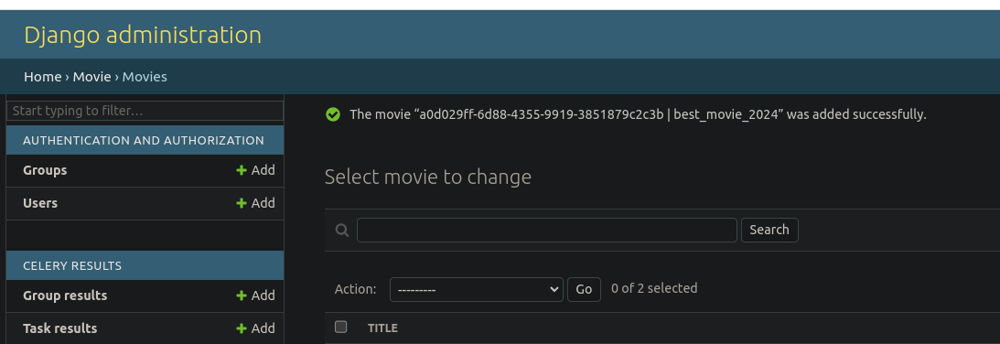

# Распределенное хранение файлов

Репозиторий проекта
https://github.com/VadimVolkovsky/graduate_work

## Запуск проекта:

Подготовить окружение
```
cp .env_example .env
cp auth_service/.env.example auth_service/.env
```

Собрать и запустить контейнеры
```
docker compose up
```

Выполнить миграции в сервисе auth
```
make migrate_auth
```

Создать роли в сервисе auth
```
make create_roles
```

Создать пользователя с активированной подпиской в сервисе auth
```
make create_subscriber
```

Учетные данные пользователя с активированной подпиской
```
username: user@mail.ru
password: user
```

Если в настройках env установлен флаг DEBUG_QUEUE_MESSAGE=True, то тестовый видео файл будет автоматически сконвертирован и доступен для просмотра по адресу
```
http://localhost:8080/cc733c92-6853-45f6-8e49-bec741188ebb
```

В остальных случаях необходимо выполнить дополнительные шаги:

Создать дефолтную корзину в Minio
```
make create_bucket
```

Создать супер-пользователя в админке
```
make createsuperuser
```

Перейти в админку и ввести учетные данные созданного супер-пользователя
```
http://localhost/admin/
```

В разделе movies нажать кнопку add

Заполнить форму добавления фильма и прикрепить файл в формате mp4, нажать Save:



Скопировать uuid фильма (появится сверху над формой)


Для просмотра фильма перейти в браузере на адрес:
```
http://localhost:8080/<film_uuid>
```

Ввести учетные данные созданного пользователя с активной подпиской

Наслаждаться просмотром фильма

__________________________

Схема архитектуры в drawio
```
https://drive.google.com/file/d/11F-j3tX1yWf6DiSiiv9EIs77r701MYRW/view?usp=sharing
```